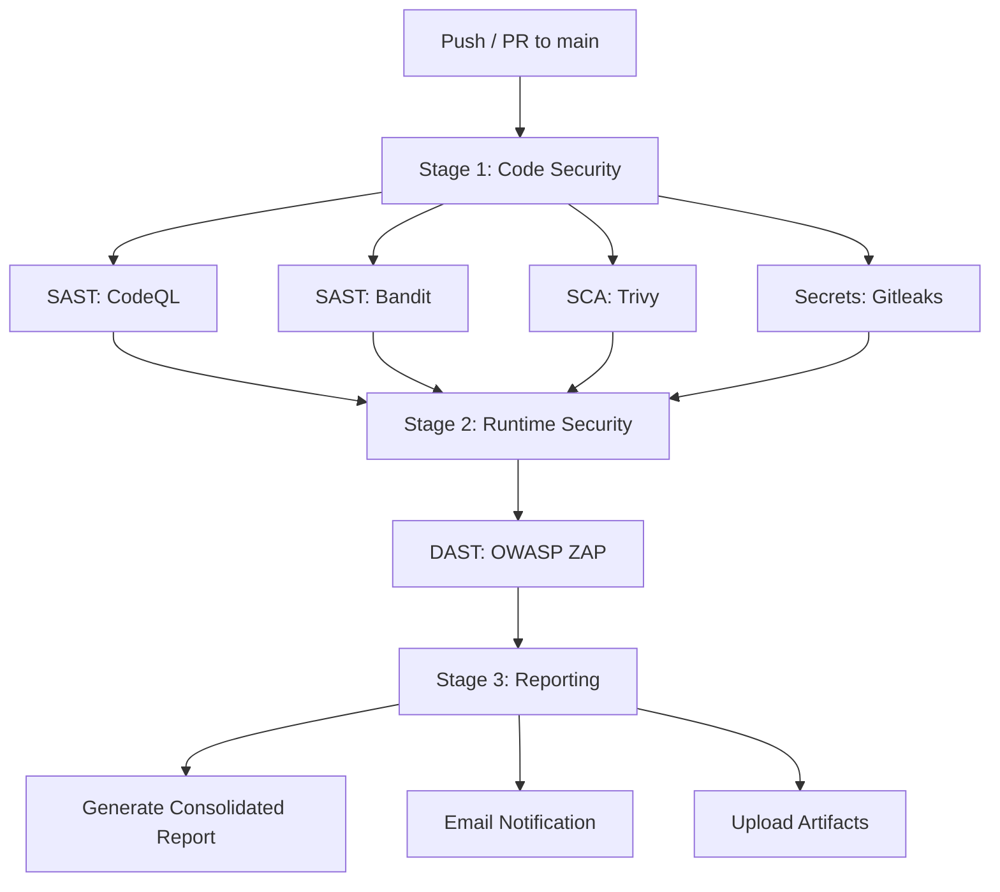

# Operation Aegis — DevSecOps Security Pipeline

> A fully automated, end-to-end DevSecOps security pipeline built on GitHub Actions, protecting a mock banking API across four layers of defense.

## The Scenario

**Skyline Financial Tech**, a rapidly scaling neobank, is moving to hourly deployments. After a leaked AWS key and a production SQL injection incident, the board has issued an ultimatum: **automate the defense in 30 days, or shut down deployment.**

Operation Aegis is the answer — an invisible, intelligent security shield built entirely on GitHub.

## Architecture



## The Four Layers of Defense

| Layer | Tools | What It Catches |
|-------|-------|-----------------|
| **SAST** (Static Analysis) | CodeQL, Bandit | SQL injection via taint analysis, hardcoded secrets, unsafe functions |
| **SCA** (Software Composition) | Trivy, Dependabot | Known CVEs in third-party dependencies (e.g., `urllib3==1.26.5`) |
| **DAST** (Dynamic Analysis) | OWASP ZAP | XSS, injection, info disclosure by fuzzing live API endpoints |
| **Secrets Scanning** | Gitleaks | API keys, passwords, tokens leaked in commit history |

## Tech Stack

| Component | Technology |
|-----------|------------|
| Backend API | Python 3.11, FastAPI, SQLAlchemy, SQLite |
| Containerization | Docker, Docker Compose |
| CI/CD | GitHub Actions |
| SAST | CodeQL (`github/codeql-action@v3`), Bandit |
| SCA | Trivy (`aquasecurity/trivy-action`), Dependabot |
| DAST | OWASP ZAP (`zaproxy/action-api-scan`) |
| Secrets | Gitleaks (`gitleaks/gitleaks-action@v2`) |
| Reporting | Custom Python aggregator + SMTP email |

## Sample App — Skyline Banking API

A FastAPI mock banking API with **intentionally planted vulnerabilities** for the scanners to detect:

| Endpoint | Vulnerability |
|----------|--------------|
| `POST /auth/register` | No password strength validation |
| `POST /auth/login` | Hardcoded JWT secret, no token expiry |
| `GET /accounts/{id}` | IDOR (no ownership check) + SQL injection |
| `POST /accounts/{id}/transfer` | SQL injection via raw f-string queries |
| `GET /admin/debug` | Exposes `os.environ` and system info |

Additional: `requirements.txt` pins `urllib3==1.26.5` with known CVEs (CVE-2023-43804, CVE-2023-45803).

## Pipeline Behavior

- **`main` branch intentionally FAILS** — proving all scanners correctly detect the planted vulnerabilities
- **`fix/secure-skyline` branch PASSES** — demonstrating remediation (parameterized queries, env-var secrets, patched deps)

This before/after flow validates the pipeline catches real issues and passes after proper fixes.

## Project Structure

```
skyline-banking-api/
├── app/
│   ├── main.py              # FastAPI entry point
│   ├── config.py            # Hardcoded secrets (intentional)
│   ├── database.py          # SQLAlchemy engine + session
│   ├── models.py            # User and Account models
│   ├── auth.py              # Register/login routes
│   ├── accounts.py          # Balance/transfer routes (SQLi)
│   └── admin.py             # Debug endpoint (info leak)
├── tests/                   # Endpoint tests
├── scripts/
│   └── generate_report.py   # Merges scan JSONs into Markdown
├── .github/
│   ├── workflows/
│   │   └── aegis-pipeline.yml
│   └── dependabot.yml
├── .gitleaks.toml           # Custom secret scanning rules
├── Dockerfile
├── docker-compose.yml
└── requirements.txt
```

## Running Locally

```bash
git clone https://github.com/0x-Shyam-Sec/Operation-Aegis.git
cd Operation-Aegis

# Install dependencies
pip install -r requirements.txt

# Run the API
uvicorn app.main:app --reload

# Or run with Docker
docker-compose up --build

# API docs at http://localhost:8000/docs
```

## Report Output

The pipeline generates a consolidated Markdown report aggregating findings from all scanners:

| Scanner  | Findings | Critical | High | Medium | Low | Status |
|----------|----------|----------|------|--------|-----|--------|
| CodeQL   | -        | -        | -    | -      | -   | -      |
| Bandit   | -        | -        | -    | -      | -   | -      |
| Trivy    | -        | -        | -    | -      | -   | -      |
| ZAP      | -        | -        | -    | -      | -   | -      |
| Gitleaks | -        | -        | -    | -      | -   | -      |

*Table populates with real data after pipeline execution.*

## Current Status

This repository currently contains the **design spec** and **implementation plan**. The full pipeline implementation is in progress.

- [Design Spec](docs/2026-04-06-operation-aegis-design.md) — Architecture and decisions
- [Implementation Plan](docs/plans/2026-04-06-operation-aegis.md) — 12-task build plan with TDD

## License

MIT
