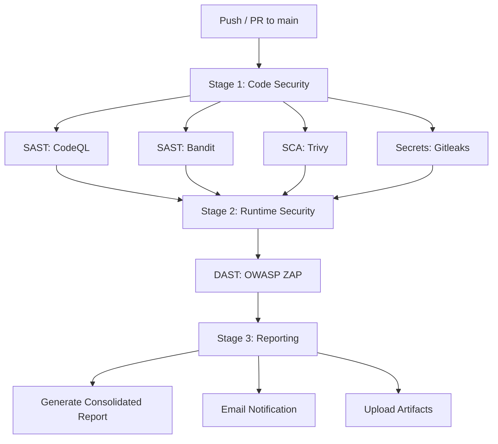

# Guardrail CI — DevSecOps Security Pipeline


> A fully automated, end-to-end DevSecOps security pipeline built on GitHub Actions, protecting a mock banking API across four layers of defense.

## The Scenario

**Skyline Financial Tech**, a rapidly scaling neobank, is moving to hourly deployments. After a leaked AWS key and a production SQL injection incident, the board has issued an ultimatum: **automate the defense in 30 days, or shut down deployment.**

Guardrail CI is the answer — an invisible, intelligent security shield built entirely on GitHub.

## Architecture



## The Four Layers of Defense

| Layer | Tools | What It Catches |
|-------|-------|-----------------|
| **SAST** (Static Analysis) | CodeQL, Bandit | SQL injection via taint analysis, hardcoded secrets, unsafe functions |
| **SCA** (Software Composition) | Trivy, Dependabot | Known CVEs in third-party dependencies (e.g., `urllib3==1.26.5`) |
| **DAST** (Dynamic Analysis) | OWASP ZAP | XSS, injection, info disclosure by fuzzing live API endpoints |
| **Secrets Scanning** | Gitleaks | API keys, passwords, tokens leaked in commit history |

## Tech Stack

| Component | Technology |
|-----------|------------|
| Backend API | Python 3.11, FastAPI, SQLAlchemy, SQLite |
| Containerization | Docker, Docker Compose |
| CI/CD | GitHub Actions |
| SAST | CodeQL (`github/codeql-action@v3`), Bandit |
| SCA | Trivy (`aquasecurity/trivy-action`), Dependabot |
| DAST | OWASP ZAP (`zaproxy/action-api-scan`) |
| Secrets | Gitleaks (`gitleaks/gitleaks-action@v2`) |
| Reporting | Custom Python aggregator + SMTP email |

## Sample App — Skyline Banking API

A FastAPI mock banking API with **intentionally planted vulnerabilities** for the scanners to detect:

| Endpoint | Vulnerability |
|----------|--------------|
| `POST /auth/register` | No password strength validation |
| `POST /auth/login` | Hardcoded JWT secret, no token expiry |
| `GET /accounts/{id}` | IDOR (no ownership check) + SQL injection |
| `POST /accounts/{id}/transfer` | SQL injection via raw f-string queries |
| `GET /admin/debug` | Exposes `os.environ` and system info |

Additional: `requirements.txt` pins `urllib3==1.26.5` and `python-jose==3.3.0` with known CVEs.

## Pipeline Results

The `main` branch **intentionally FAILS** the security pipeline — proving the scanners work:

| Scanner | Findings | Status |
|---------|----------|--------|
| Bandit (SAST) | 5 SQL injection vectors in `accounts.py` | FAIL |
| Trivy (SCA) | 5 HIGH/CRITICAL CVEs (`urllib3`, `python-jose`) | FAIL |
| Gitleaks (Secrets) | 21 secrets across git history | FAIL |
| OWASP ZAP (DAST) | Vulnerabilities found in live API | FAIL |
| CodeQL (SAST) | Analysis completed | PASS |

The [`fix/secure-skyline`](../../pull/14) branch fixes all vulnerabilities and demonstrates a **green pipeline**.

### What was fixed

| Vulnerability | Fix Applied |
|--------------|-------------|
| Hardcoded secrets | Replaced with `os.environ.get()` |
| SQL injection | Replaced raw queries with ORM parameterized queries |
| IDOR | Added ownership checks (403 Access Denied) |
| Info leak (`/admin/debug`) | Removed, replaced with safe `/admin/status` |
| Vulnerable `python-jose` | Replaced with `pyjwt==2.8.0` |
| Vulnerable `urllib3` | Updated to `2.1.0` |
| No password validation | Added minimum 8 character requirement |
| No token expiry | Added 1-hour JWT expiry |

## Project Structure

```
.
├── app/
│   ├── main.py              # FastAPI entry point
│   ├── config.py            # Hardcoded secrets (intentional)
│   ├── database.py          # SQLAlchemy engine + session
│   ├── models.py            # User and Account models
│   ├── auth.py              # Register/login routes
│   ├── accounts.py          # Balance/transfer routes (SQLi)
│   └── admin.py             # Debug endpoint (info leak)
├── tests/                   # Endpoint tests (8 tests)
├── scripts/
│   └── generate_report.py   # Merges scan JSONs into Markdown report
├── .github/
│   ├── workflows/
│   │   └── aegis-pipeline.yml  # Full 4-layer security pipeline
│   └── dependabot.yml          # Automated dependency monitoring
├── .gitleaks.toml           # Custom secret scanning rules
├── Dockerfile
├── docker-compose.yml
└── requirements.txt
```

## Running Locally

```bash
git clone https://github.com/0xShyam-Sec/Guardrail-CI.git
cd Guardrail-CI

# Install dependencies
pip install -r requirements.txt

# Run the API
uvicorn app.main:app --reload

# Or run with Docker
docker compose up --build

# API docs at http://localhost:8000/docs
```

## How the Pipeline Works

```
Developer pushes code to GitHub
       |
       v
GitHub Actions triggers automatically
       |
       v
Stage 1 (parallel — ~60 seconds):
  -> CodeQL: taint analysis for logic flaws
  -> Bandit: Python-specific security lint
  -> Trivy: CVE scan on dependencies
  -> Gitleaks: secret detection in git history
       |
       v
Stage 2 (sequential — ~2 minutes):
  -> Docker builds and starts the app
  -> OWASP ZAP attacks the live API via OpenAPI spec
  -> Container torn down
       |
       v
Stage 3 (always runs):
  -> All scan results merged into one Markdown report
  -> Report uploaded as GitHub artifact
  -> Email notification sent (if configured)
       |
       v
If ANY scanner finds HIGH/CRITICAL issues -> BUILD FAILS
```

## Documentation

- [Design Spec](docs/2026-04-06-operation-aegis-design.md) — Architecture and decisions
- [Implementation Plan](docs/plans/2026-04-06-operation-aegis.md) — 12-task build plan

## License

MIT
# test trigger
