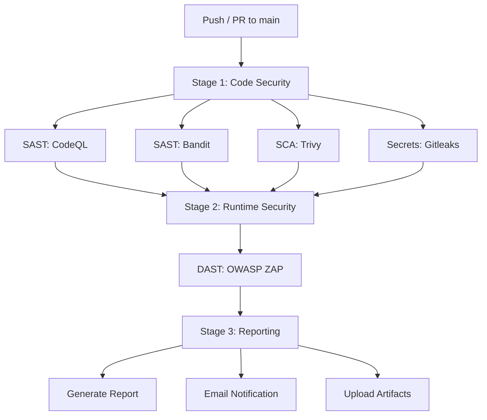

# Operation Aegis Implementation Plan

> **For agentic workers:** REQUIRED SUB-SKILL: Use superpowers:subagent-driven-development (recommended) or superpowers:executing-plans to implement this plan task-by-task. Steps use checkbox (`- [ ]`) syntax for tracking.

**Goal:** Build a fully automated DevSecOps pipeline on GitHub Actions that scans a deliberately vulnerable FastAPI banking app across four security layers (SAST, SCA, DAST, Secrets) with consolidated reporting and email notifications.

**Architecture:** A FastAPI mock banking API with planted vulnerabilities serves as the scan target. A single GitHub Actions workflow (`aegis-pipeline.yml`) orchestrates parallel Stage 1 jobs (CodeQL, Bandit, Trivy, Gitleaks), a Stage 2 DAST job (OWASP ZAP against a Docker container), and a Stage 3 reporting job that merges all results and sends email alerts. A "fix" branch later demonstrates a green pipeline.

**Tech Stack:** Python 3.11, FastAPI, SQLAlchemy, SQLite, Docker, GitHub Actions, CodeQL, Bandit, Trivy, Gitleaks, OWASP ZAP, shields.io

---

## File Structure

```
skyline-banking-api/
├── app/
│   ├── __init__.py            # Empty init
│   ├── main.py                # FastAPI app entry, mounts routers
│   ├── config.py              # Hardcoded secrets (intentional vuln)
│   ├── database.py            # SQLAlchemy engine + session
│   ├── models.py              # User and Account ORM models
│   ├── auth.py                # /auth/register, /auth/login routes
│   ├── accounts.py            # /accounts/{id}, /accounts/{id}/transfer routes
│   └── admin.py               # /admin/debug route
├── tests/
│   ├── __init__.py
│   ├── conftest.py            # Shared fixtures (test client, test DB)
│   ├── test_auth.py           # Auth endpoint tests
│   ├── test_accounts.py       # Account endpoint tests
│   └── test_admin.py          # Admin endpoint tests
├── scripts/
│   └── generate_report.py     # Merges scan JSONs into Markdown summary
├── .github/
│   ├── workflows/
│   │   └── aegis-pipeline.yml # Full 4-layer security pipeline
│   └── dependabot.yml         # Automated dependency monitoring
├── .gitleaks.toml             # Custom Gitleaks rules
├── Dockerfile                 # Container for the FastAPI app
├── docker-compose.yml         # Orchestrates app for DAST scanning
├── requirements.txt           # Pinned deps (includes intentionally old urllib3)
└── README.md                  # Created last — master documentation
```

---

### Task 1: Project Scaffolding and Config

**Files:**
- Create: `app/__init__.py`
- Create: `app/config.py`
- Create: `app/database.py`
- Create: `app/models.py`
- Create: `requirements.txt`

- [ ] **Step 1: Create `requirements.txt` with intentionally vulnerable deps**

```txt
fastapi==0.104.1
uvicorn==0.24.0
sqlalchemy==2.0.23
python-jose==3.3.0
passlib==1.7.4
bcrypt==4.1.2
httpx==0.25.2
pytest==7.4.3
urllib3==1.26.5
```

Note: `urllib3==1.26.5` has known CVEs (CVE-2023-43804, CVE-2023-45803). This is intentional — Trivy will flag it.

- [ ] **Step 2: Create `app/__init__.py`**

```python
```

Empty file — makes `app/` a Python package.

- [ ] **Step 3: Create `app/config.py` with hardcoded secrets (intentional vuln)**

```python
# WARNING: These are intentionally hardcoded for security scanning demonstration.
# In production, use environment variables or a secrets manager.

SECRET_KEY = "skyline-super-secret-123"
ALGORITHM = "HS256"
DATABASE_URL = "sqlite:///./skyline.db"
ADMIN_PASSWORD = "admin123"
```

This file will trigger Bandit (hardcoded passwords) and Gitleaks (secret patterns).

- [ ] **Step 4: Create `app/database.py`**

```python
from sqlalchemy import create_engine
from sqlalchemy.orm import sessionmaker, DeclarativeBase

from app.config import DATABASE_URL

engine = create_engine(DATABASE_URL, connect_args={"check_same_thread": False})
SessionLocal = sessionmaker(autocommit=False, autoflush=False, bind=engine)


class Base(DeclarativeBase):
    pass


def get_db():
    db = SessionLocal()
    try:
        yield db
    finally:
        db.close()
```

- [ ] **Step 5: Create `app/models.py`**

```python
from sqlalchemy import Column, Integer, String, Float

from app.database import Base


class User(Base):
    __tablename__ = "users"

    id = Column(Integer, primary_key=True, index=True)
    username = Column(String, unique=True, index=True, nullable=False)
    hashed_password = Column(String, nullable=False)


class Account(Base):
    __tablename__ = "accounts"

    id = Column(Integer, primary_key=True, index=True)
    user_id = Column(Integer, nullable=False)
    balance = Column(Float, default=1000.0)
```

- [ ] **Step 6: Commit scaffolding**

```bash
git add app/__init__.py app/config.py app/database.py app/models.py requirements.txt
git commit -m "feat: add project scaffolding with config, database, and models"
```

---

### Task 2: Auth Routes (Register + Login)

**Files:**
- Create: `app/auth.py`
- Create: `tests/__init__.py`
- Create: `tests/conftest.py`
- Create: `tests/test_auth.py`

- [ ] **Step 1: Create `tests/__init__.py`**

```python
```

- [ ] **Step 2: Create `tests/conftest.py` with shared fixtures**

```python
import pytest
from fastapi.testclient import TestClient
from sqlalchemy import create_engine
from sqlalchemy.orm import sessionmaker

from app.database import Base, get_db
from app.main import app

TEST_DATABASE_URL = "sqlite:///./test_skyline.db"
engine = create_engine(TEST_DATABASE_URL, connect_args={"check_same_thread": False})
TestingSessionLocal = sessionmaker(autocommit=False, autoflush=False, bind=engine)


@pytest.fixture(autouse=True)
def setup_db():
    Base.metadata.create_all(bind=engine)
    yield
    Base.metadata.drop_all(bind=engine)


@pytest.fixture
def db():
    db = TestingSessionLocal()
    try:
        yield db
    finally:
        db.close()


@pytest.fixture
def client(db):
    def override_get_db():
        try:
            yield db
        finally:
            pass

    app.dependency_overrides[get_db] = override_get_db
    yield TestClient(app)
    app.dependency_overrides.clear()
```

- [ ] **Step 3: Write failing tests for auth endpoints in `tests/test_auth.py`**

```python
def test_register_creates_user(client):
    response = client.post("/auth/register", json={
        "username": "testuser",
        "password": "password123"
    })
    assert response.status_code == 201
    data = response.json()
    assert data["username"] == "testuser"
    assert "id" in data


def test_register_duplicate_user(client):
    client.post("/auth/register", json={
        "username": "testuser",
        "password": "password123"
    })
    response = client.post("/auth/register", json={
        "username": "testuser",
        "password": "password123"
    })
    assert response.status_code == 400


def test_login_returns_token(client):
    client.post("/auth/register", json={
        "username": "testuser",
        "password": "password123"
    })
    response = client.post("/auth/login", json={
        "username": "testuser",
        "password": "password123"
    })
    assert response.status_code == 200
    data = response.json()
    assert "access_token" in data


def test_login_wrong_password(client):
    client.post("/auth/register", json={
        "username": "testuser",
        "password": "password123"
    })
    response = client.post("/auth/login", json={
        "username": "testuser",
        "password": "wrongpassword"
    })
    assert response.status_code == 401
```

- [ ] **Step 4: Run tests to verify they fail**

```bash
pip install -r requirements.txt
pytest tests/test_auth.py -v
```

Expected: FAIL — `app.main` doesn't exist yet.

- [ ] **Step 5: Create `app/auth.py`**

```python
from fastapi import APIRouter, Depends, HTTPException
from pydantic import BaseModel
from sqlalchemy.orm import Session
from passlib.context import CryptContext
from jose import jwt

from app.config import SECRET_KEY, ALGORITHM
from app.database import get_db
from app.models import User, Account

router = APIRouter(prefix="/auth", tags=["auth"])
pwd_context = CryptContext(schemes=["bcrypt"], deprecated="auto")


class RegisterRequest(BaseModel):
    username: str
    password: str


class LoginRequest(BaseModel):
    username: str
    password: str


@router.post("/register", status_code=201)
def register(request: RegisterRequest, db: Session = Depends(get_db)):
    existing = db.query(User).filter(User.username == request.username).first()
    if existing:
        raise HTTPException(status_code=400, detail="Username already exists")

    # Intentional vuln: no password strength validation
    hashed = pwd_context.hash(request.password)
    user = User(username=request.username, hashed_password=hashed)
    db.add(user)
    db.commit()
    db.refresh(user)

    # Create a default account with $1000
    account = Account(user_id=user.id, balance=1000.0)
    db.add(account)
    db.commit()

    return {"id": user.id, "username": user.username}


@router.post("/login")
def login(request: LoginRequest, db: Session = Depends(get_db)):
    user = db.query(User).filter(User.username == request.username).first()
    if not user or not pwd_context.verify(request.password, user.hashed_password):
        raise HTTPException(status_code=401, detail="Invalid credentials")

    # Intentional vuln: no token expiry
    token = jwt.encode({"sub": str(user.id)}, SECRET_KEY, algorithm=ALGORITHM)
    return {"access_token": token, "token_type": "bearer"}
```

- [ ] **Step 6: Create `app/main.py`**

```python
from fastapi import FastAPI

from app.database import Base, engine
from app.auth import router as auth_router

Base.metadata.create_all(bind=engine)

app = FastAPI(
    title="Skyline Banking API",
    description="Mock banking API for Operation Aegis DevSecOps demonstration",
    version="1.0.0",
)

app.include_router(auth_router)


@app.get("/health")
def health_check():
    return {"status": "healthy"}
```

- [ ] **Step 7: Run tests to verify they pass**

```bash
pytest tests/test_auth.py -v
```

Expected: All 4 tests PASS.

- [ ] **Step 8: Commit**

```bash
git add app/auth.py app/main.py tests/
git commit -m "feat: add auth routes (register/login) with tests"
```

---

### Task 3: Account Routes (Balance + Transfer with SQLi)

**Files:**
- Create: `app/accounts.py`
- Create: `tests/test_accounts.py`

- [ ] **Step 1: Write failing tests in `tests/test_accounts.py`**

```python
from jose import jwt
from app.config import SECRET_KEY, ALGORITHM


def _get_auth_header(client, username="testuser", password="password123"):
    client.post("/auth/register", json={
        "username": username,
        "password": password,
    })
    response = client.post("/auth/login", json={
        "username": username,
        "password": password,
    })
    token = response.json()["access_token"]
    return {"Authorization": f"Bearer {token}"}


def test_get_account_balance(client):
    headers = _get_auth_header(client)
    token = headers["Authorization"].split(" ")[1]
    payload = jwt.decode(token, SECRET_KEY, algorithms=[ALGORITHM])
    user_id = int(payload["sub"])

    response = client.get(f"/accounts/{user_id}", headers=headers)
    assert response.status_code == 200
    data = response.json()
    assert data["balance"] == 1000.0


def test_transfer_money(client):
    headers1 = _get_auth_header(client, "user1", "pass1")
    headers2 = _get_auth_header(client, "user2", "pass2")

    token1 = headers1["Authorization"].split(" ")[1]
    payload1 = jwt.decode(token1, SECRET_KEY, algorithms=[ALGORITHM])
    user1_id = int(payload1["sub"])

    token2 = headers2["Authorization"].split(" ")[1]
    payload2 = jwt.decode(token2, SECRET_KEY, algorithms=[ALGORITHM])
    user2_id = int(payload2["sub"])

    response = client.post(f"/accounts/{user1_id}/transfer", json={
        "to_account_id": user2_id,
        "amount": 250.0,
    }, headers=headers1)
    assert response.status_code == 200
    assert response.json()["message"] == "Transfer successful"

    # Check balances
    r1 = client.get(f"/accounts/{user1_id}", headers=headers1)
    r2 = client.get(f"/accounts/{user2_id}", headers=headers2)
    assert r1.json()["balance"] == 750.0
    assert r2.json()["balance"] == 1250.0


def test_transfer_insufficient_funds(client):
    headers = _get_auth_header(client)
    token = headers["Authorization"].split(" ")[1]
    payload = jwt.decode(token, SECRET_KEY, algorithms=[ALGORITHM])
    user_id = int(payload["sub"])

    response = client.post(f"/accounts/{user_id}/transfer", json={
        "to_account_id": 999,
        "amount": 99999.0,
    }, headers=headers)
    assert response.status_code == 400
```

- [ ] **Step 2: Run tests to verify they fail**

```bash
pytest tests/test_accounts.py -v
```

Expected: FAIL — accounts routes not registered.

- [ ] **Step 3: Create `app/accounts.py` with intentional SQL injection**

```python
from fastapi import APIRouter, Depends, HTTPException
from pydantic import BaseModel
from sqlalchemy.orm import Session
from sqlalchemy import text
from jose import jwt, JWTError

from app.config import SECRET_KEY, ALGORITHM
from app.database import get_db

router = APIRouter(prefix="/accounts", tags=["accounts"])


class TransferRequest(BaseModel):
    to_account_id: int
    amount: float


def get_current_user_id(authorization: str = None):
    if not authorization or not authorization.startswith("Bearer "):
        raise HTTPException(status_code=401, detail="Not authenticated")
    token = authorization.split(" ")[1]
    try:
        payload = jwt.decode(token, SECRET_KEY, algorithms=[ALGORITHM])
        return int(payload["sub"])
    except JWTError:
        raise HTTPException(status_code=401, detail="Invalid token")


@router.get("/{account_id}")
def get_account(account_id: int, authorization: str = None,
                db: Session = Depends(get_db)):
    get_current_user_id(authorization)
    # Intentional vuln: IDOR — no check that account belongs to the requesting user

    # Intentional vuln: SQL injection via raw query
    query = text(f"SELECT * FROM accounts WHERE user_id = {account_id}")
    result = db.execute(query).fetchone()
    if not result:
        raise HTTPException(status_code=404, detail="Account not found")
    return {"id": result[0], "user_id": result[1], "balance": result[2]}


@router.post("/{account_id}/transfer")
def transfer(account_id: int, request: TransferRequest,
             authorization: str = None, db: Session = Depends(get_db)):
    user_id = get_current_user_id(authorization)

    # Intentional vuln: SQL injection via raw query
    from_query = text(f"SELECT * FROM accounts WHERE user_id = {account_id}")
    from_account = db.execute(from_query).fetchone()
    if not from_account:
        raise HTTPException(status_code=404, detail="Source account not found")

    if from_account[2] < request.amount:
        raise HTTPException(status_code=400, detail="Insufficient funds")

    to_query = text(f"SELECT * FROM accounts WHERE user_id = {request.to_account_id}")
    to_account = db.execute(to_query).fetchone()
    if not to_account:
        raise HTTPException(status_code=404, detail="Destination account not found")

    # Execute transfer with raw SQL (intentional vuln)
    db.execute(text(
        f"UPDATE accounts SET balance = balance - {request.amount} "
        f"WHERE user_id = {account_id}"
    ))
    db.execute(text(
        f"UPDATE accounts SET balance = balance + {request.amount} "
        f"WHERE user_id = {request.to_account_id}"
    ))
    db.commit()

    return {"message": "Transfer successful"}
```

- [ ] **Step 4: Register accounts router in `app/main.py`**

Add the import and include_router to `app/main.py`:

```python
from fastapi import FastAPI

from app.database import Base, engine
from app.auth import router as auth_router
from app.accounts import router as accounts_router

Base.metadata.create_all(bind=engine)

app = FastAPI(
    title="Skyline Banking API",
    description="Mock banking API for Operation Aegis DevSecOps demonstration",
    version="1.0.0",
)

app.include_router(auth_router)
app.include_router(accounts_router)


@app.get("/health")
def health_check():
    return {"status": "healthy"}
```

- [ ] **Step 5: Run tests to verify they pass**

```bash
pytest tests/test_accounts.py -v
```

Expected: All 3 tests PASS.

- [ ] **Step 6: Commit**

```bash
git add app/accounts.py app/main.py tests/test_accounts.py
git commit -m "feat: add account routes (balance/transfer) with intentional SQLi"
```

---

### Task 4: Admin Debug Route

**Files:**
- Create: `app/admin.py`
- Create: `tests/test_admin.py`

- [ ] **Step 1: Write failing test in `tests/test_admin.py`**

```python
def test_debug_endpoint_exposes_env(client):
    response = client.get("/admin/debug")
    assert response.status_code == 200
    data = response.json()
    assert "environment" in data
    assert "python_version" in data
```

- [ ] **Step 2: Run test to verify it fails**

```bash
pytest tests/test_admin.py -v
```

Expected: FAIL — admin route not registered.

- [ ] **Step 3: Create `app/admin.py` with intentional info leak**

```python
import os
import sys

from fastapi import APIRouter

router = APIRouter(prefix="/admin", tags=["admin"])


@router.get("/debug")
def debug_info():
    # Intentional vuln: exposes environment variables and system info
    return {
        "environment": dict(os.environ),
        "python_version": sys.version,
        "platform": sys.platform,
    }
```

- [ ] **Step 4: Register admin router in `app/main.py`**

Update `app/main.py` to include the admin router:

```python
from fastapi import FastAPI

from app.database import Base, engine
from app.auth import router as auth_router
from app.accounts import router as accounts_router
from app.admin import router as admin_router

Base.metadata.create_all(bind=engine)

app = FastAPI(
    title="Skyline Banking API",
    description="Mock banking API for Operation Aegis DevSecOps demonstration",
    version="1.0.0",
)

app.include_router(auth_router)
app.include_router(accounts_router)
app.include_router(admin_router)


@app.get("/health")
def health_check():
    return {"status": "healthy"}
```

- [ ] **Step 5: Run tests to verify they pass**

```bash
pytest tests/test_admin.py -v
```

Expected: PASS.

- [ ] **Step 6: Run all tests to verify nothing is broken**

```bash
pytest tests/ -v
```

Expected: All tests PASS (auth + accounts + admin).

- [ ] **Step 7: Commit**

```bash
git add app/admin.py app/main.py tests/test_admin.py
git commit -m "feat: add admin debug endpoint with intentional info leak"
```

---

### Task 5: Docker Setup

**Files:**
- Create: `Dockerfile`
- Create: `docker-compose.yml`

- [ ] **Step 1: Create `Dockerfile`**

```dockerfile
FROM python:3.11-slim

WORKDIR /app

COPY requirements.txt .
RUN pip install --no-cache-dir -r requirements.txt

COPY app/ ./app/

EXPOSE 8000

CMD ["uvicorn", "app.main:app", "--host", "0.0.0.0", "--port", "8000"]
```

- [ ] **Step 2: Create `docker-compose.yml`**

```yaml
version: "3.8"

services:
  skyline-api:
    build: .
    ports:
      - "8000:8000"
    environment:
      - DATABASE_URL=sqlite:///./skyline.db
    healthcheck:
      test: ["CMD", "python", "-c", "import urllib.request; urllib.request.urlopen('http://localhost:8000/health')"]
      interval: 5s
      timeout: 3s
      retries: 5
```

- [ ] **Step 3: Build and test locally**

```bash
docker-compose build
docker-compose up -d
```

Wait for health check, then:

```bash
curl http://localhost:8000/health
```

Expected: `{"status":"healthy"}`

```bash
curl http://localhost:8000/docs
```

Expected: FastAPI Swagger UI HTML.

```bash
docker-compose down
```

- [ ] **Step 4: Commit**

```bash
git add Dockerfile docker-compose.yml
git commit -m "feat: add Docker setup for containerized deployment"
```

---

### Task 6: Gitleaks Configuration

**Files:**
- Create: `.gitleaks.toml`

- [ ] **Step 1: Create `.gitleaks.toml`**

```toml
[extend]
# Use the default gitleaks config as a base
useDefault = true

# Custom rule to catch Skyline-specific patterns
[[rules]]
id = "skyline-secret-key"
description = "Skyline hardcoded secret key"
regex = '''(?i)secret_key\s*=\s*["\'][^"\']+["\']'''
tags = ["key", "skyline"]

[[rules]]
id = "skyline-admin-password"
description = "Skyline hardcoded admin password"
regex = '''(?i)admin_password\s*=\s*["\'][^"\']+["\']'''
tags = ["password", "skyline"]

[allowlist]
description = "Global allowlist"
paths = [
    '''\.gitleaks\.toml''',
]
```

- [ ] **Step 2: Install gitleaks locally and test (optional)**

```bash
# If gitleaks is installed:
gitleaks detect --source . -v
```

Expected: Should find secrets in `app/config.py`.

- [ ] **Step 3: Commit**

```bash
git add .gitleaks.toml
git commit -m "feat: add Gitleaks config for secret scanning"
```

---

### Task 7: Dependabot Configuration

**Files:**
- Create: `.github/dependabot.yml`

- [ ] **Step 1: Create `.github/dependabot.yml`**

```bash
mkdir -p .github
```

```yaml
version: 2
updates:
  - package-ecosystem: "pip"
    directory: "/"
    schedule:
      interval: "weekly"
    open-pull-requests-limit: 10
    labels:
      - "dependencies"
      - "security"

  - package-ecosystem: "github-actions"
    directory: "/"
    schedule:
      interval: "weekly"
    labels:
      - "dependencies"
      - "ci"
```

- [ ] **Step 2: Commit**

```bash
git add .github/dependabot.yml
git commit -m "feat: add Dependabot config for pip and Actions monitoring"
```

---

### Task 8: Report Generation Script

**Files:**
- Create: `scripts/generate_report.py`

- [ ] **Step 1: Create `scripts/generate_report.py`**

```bash
mkdir -p scripts
```

```python
#!/usr/bin/env python3
"""Merge security scan results into a single Markdown report."""

import json
import sys
from datetime import datetime, timezone
from pathlib import Path


def parse_bandit(path: str) -> dict:
    """Parse Bandit JSON output."""
    try:
        data = json.loads(Path(path).read_text())
    except (FileNotFoundError, json.JSONDecodeError):
        return {"findings": 0, "critical": 0, "high": 0, "medium": 0, "low": 0}

    severity_counts = {"critical": 0, "high": 0, "medium": 0, "low": 0}
    details = []
    for result in data.get("results", []):
        sev = result.get("issue_severity", "LOW").lower()
        if sev == "undefined":
            sev = "low"
        severity_counts[sev] = severity_counts.get(sev, 0) + 1
        details.append({
            "file": result.get("filename", "unknown"),
            "line": result.get("line_number", 0),
            "severity": sev.upper(),
            "issue": result.get("issue_text", ""),
            "cwe": result.get("issue_cwe", {}).get("id", "N/A"),
        })

    total = sum(severity_counts.values())
    return {**severity_counts, "findings": total, "details": details}


def parse_trivy(path: str) -> dict:
    """Parse Trivy JSON output."""
    try:
        data = json.loads(Path(path).read_text())
    except (FileNotFoundError, json.JSONDecodeError):
        return {"findings": 0, "critical": 0, "high": 0, "medium": 0, "low": 0}

    severity_counts = {"critical": 0, "high": 0, "medium": 0, "low": 0}
    details = []

    results = data.get("Results", [])
    for result in results:
        for vuln in result.get("Vulnerabilities", []):
            sev = vuln.get("Severity", "LOW").lower()
            severity_counts[sev] = severity_counts.get(sev, 0) + 1
            details.append({
                "package": vuln.get("PkgName", "unknown"),
                "version": vuln.get("InstalledVersion", "unknown"),
                "severity": sev.upper(),
                "vuln_id": vuln.get("VulnerabilityID", "N/A"),
                "title": vuln.get("Title", ""),
            })

    total = sum(severity_counts.values())
    return {**severity_counts, "findings": total, "details": details}


def parse_gitleaks(path: str) -> dict:
    """Parse Gitleaks JSON output."""
    try:
        data = json.loads(Path(path).read_text())
    except (FileNotFoundError, json.JSONDecodeError):
        return {"findings": 0, "critical": 0, "high": 0, "medium": 0, "low": 0}

    if not isinstance(data, list):
        data = []

    details = []
    for finding in data:
        details.append({
            "file": finding.get("File", "unknown"),
            "rule": finding.get("RuleID", "unknown"),
            "match": finding.get("Match", "")[:50] + "...",
        })

    count = len(data)
    return {
        "findings": count,
        "critical": count,  # All secret leaks are critical
        "high": 0,
        "medium": 0,
        "low": 0,
        "details": details,
    }


def parse_zap(path: str) -> dict:
    """Parse ZAP JSON report."""
    try:
        data = json.loads(Path(path).read_text())
    except (FileNotFoundError, json.JSONDecodeError):
        return {"findings": 0, "critical": 0, "high": 0, "medium": 0, "low": 0}

    risk_map = {"3": "high", "2": "medium", "1": "low", "0": "low"}
    severity_counts = {"critical": 0, "high": 0, "medium": 0, "low": 0}
    details = []

    for site in data.get("site", []):
        for alert in site.get("alerts", []):
            risk = risk_map.get(str(alert.get("riskcode", "0")), "low")
            severity_counts[risk] = severity_counts.get(risk, 0) + 1
            details.append({
                "alert": alert.get("alert", "unknown"),
                "risk": risk.upper(),
                "description": alert.get("desc", "")[:100],
                "url": alert.get("url", "N/A"),
            })

    total = sum(severity_counts.values())
    return {**severity_counts, "findings": total, "details": details}


def status_label(result: dict) -> str:
    if result["critical"] > 0 or result["high"] > 0:
        return "FAIL"
    return "PASS"


def generate_report(
    bandit_path: str,
    trivy_path: str,
    gitleaks_path: str,
    zap_path: str,
    commit_sha: str = "unknown",
) -> str:
    """Generate the full Markdown report."""
    bandit = parse_bandit(bandit_path)
    trivy = parse_trivy(trivy_path)
    gitleaks = parse_gitleaks(gitleaks_path)
    zap = parse_zap(zap_path)

    now = datetime.now(timezone.utc).strftime("%Y-%m-%d %H:%M UTC")

    report = f"""# Aegis Security Report — {now} [{commit_sha[:8]}]

## Summary

| Scanner  | Findings | Critical | High | Medium | Low | Status |
|----------|----------|----------|------|--------|-----|--------|
| Bandit   | {bandit['findings']}        | {bandit['critical']}        | {bandit['high']}    | {bandit['medium']}      | {bandit['low']}   | {status_label(bandit)}   |
| Trivy    | {trivy['findings']}        | {trivy['critical']}        | {trivy['high']}    | {trivy['medium']}      | {trivy['low']}   | {status_label(trivy)}   |
| Gitleaks | {gitleaks['findings']}        | {gitleaks['critical']}        | {gitleaks['high']}    | {gitleaks['medium']}      | {gitleaks['low']}   | {status_label(gitleaks)}   |
| ZAP      | {zap['findings']}        | {zap['critical']}        | {zap['high']}    | {zap['medium']}      | {zap['low']}   | {status_label(zap)}   |

"""

    # Bandit details
    if bandit.get("details"):
        report += "## Bandit (SAST) Details\n\n"
        for d in bandit["details"]:
            report += f"- **[{d['severity']}]** `{d['file']}:{d['line']}` — {d['issue']} (CWE-{d['cwe']})\n"
        report += "\n"

    # Trivy details
    if trivy.get("details"):
        report += "## Trivy (SCA) Details\n\n"
        for d in trivy["details"]:
            report += f"- **[{d['severity']}]** `{d['package']}=={d['version']}` — {d['vuln_id']}: {d['title']}\n"
        report += "\n"

    # Gitleaks details
    if gitleaks.get("details"):
        report += "## Gitleaks (Secrets) Details\n\n"
        for d in gitleaks["details"]:
            report += f"- **[CRITICAL]** `{d['file']}` — Rule: {d['rule']}, Match: `{d['match']}`\n"
        report += "\n"

    # ZAP details
    if zap.get("details"):
        report += "## ZAP (DAST) Details\n\n"
        for d in zap["details"]:
            report += f"- **[{d['risk']}]** {d['alert']} — {d['description']}\n"
        report += "\n"

    # Overall status
    all_results = [bandit, trivy, gitleaks, zap]
    any_fail = any(status_label(r) == "FAIL" for r in all_results)
    report += f"## Overall Status: {'FAIL' if any_fail else 'PASS'}\n"

    return report


if __name__ == "__main__":
    import argparse

    parser = argparse.ArgumentParser(description="Generate Aegis security report")
    parser.add_argument("--bandit", default="bandit-report.json")
    parser.add_argument("--trivy", default="trivy-report.json")
    parser.add_argument("--gitleaks", default="gitleaks-report.json")
    parser.add_argument("--zap", default="zap-report.json")
    parser.add_argument("--commit", default="unknown")
    parser.add_argument("--output", default="aegis-report.md")

    args = parser.parse_args()

    report = generate_report(
        bandit_path=args.bandit,
        trivy_path=args.trivy,
        gitleaks_path=args.gitleaks,
        zap_path=args.zap,
        commit_sha=args.commit,
    )

    Path(args.output).write_text(report)
    print(f"Report written to {args.output}")
```

- [ ] **Step 2: Test the script locally with empty/missing inputs**

```bash
python scripts/generate_report.py --output /dev/stdout
```

Expected: Generates a report with all zeros (no scan files found). No crashes.

- [ ] **Step 3: Commit**

```bash
git add scripts/generate_report.py
git commit -m "feat: add report generation script to merge scan results"
```

---

### Task 9: GitHub Actions Pipeline

**Files:**
- Create: `.github/workflows/aegis-pipeline.yml`

- [ ] **Step 1: Create `.github/workflows/aegis-pipeline.yml`**

```bash
mkdir -p .github/workflows
```

```yaml
name: "Aegis Security Pipeline"

on:
  push:
    branches: [main]
  pull_request:
    branches: [main]

permissions:
  contents: read
  security-events: write

jobs:
  # ============================================================
  # STAGE 1: Code Security (parallel jobs)
  # ============================================================

  sast-codeql:
    name: "SAST — CodeQL"
    runs-on: ubuntu-latest
    permissions:
      contents: read
      security-events: write
    steps:
      - name: Checkout code
        uses: actions/checkout@v4

      - name: Initialize CodeQL
        uses: github/codeql-action/init@v3
        with:
          languages: python

      - name: Perform CodeQL Analysis
        uses: github/codeql-action/analyze@v3
        with:
          category: "/language:python"

  sast-bandit:
    name: "SAST — Bandit"
    runs-on: ubuntu-latest
    steps:
      - name: Checkout code
        uses: actions/checkout@v4

      - name: Set up Python
        uses: actions/setup-python@v5
        with:
          python-version: "3.11"

      - name: Install Bandit
        run: pip install bandit

      - name: Run Bandit scan
        run: |
          bandit -r app/ -f json -o bandit-report.json --severity-level medium || true

      - name: Upload Bandit report
        uses: actions/upload-artifact@v4
        with:
          name: bandit-report
          path: bandit-report.json

      - name: Fail on high severity
        run: |
          HIGH_COUNT=$(python3 -c "
          import json
          data = json.load(open('bandit-report.json'))
          high = sum(1 for r in data.get('results', []) if r.get('issue_severity') in ('HIGH', 'CRITICAL'))
          print(high)
          ")
          echo "High/Critical findings: $HIGH_COUNT"
          if [ "$HIGH_COUNT" -gt 0 ]; then
            echo "::error::Bandit found $HIGH_COUNT high/critical severity issues"
            exit 1
          fi

  sca-trivy:
    name: "SCA — Trivy"
    runs-on: ubuntu-latest
    steps:
      - name: Checkout code
        uses: actions/checkout@v4

      - name: Run Trivy filesystem scan
        uses: aquasecurity/trivy-action@master
        with:
          scan-type: "fs"
          scan-ref: "."
          format: "json"
          output: "trivy-report.json"
          severity: "HIGH,CRITICAL"

      - name: Upload Trivy report
        uses: actions/upload-artifact@v4
        with:
          name: trivy-report
          path: trivy-report.json

      - name: Fail on high/critical CVEs
        run: |
          VULN_COUNT=$(python3 -c "
          import json
          data = json.load(open('trivy-report.json'))
          count = sum(len(r.get('Vulnerabilities', [])) for r in data.get('Results', []))
          print(count)
          ")
          echo "High/Critical vulnerabilities: $VULN_COUNT"
          if [ "$VULN_COUNT" -gt 0 ]; then
            echo "::error::Trivy found $VULN_COUNT high/critical vulnerabilities"
            exit 1
          fi

  secrets-gitleaks:
    name: "Secrets — Gitleaks"
    runs-on: ubuntu-latest
    steps:
      - name: Checkout code
        uses: actions/checkout@v4
        with:
          fetch-depth: 0

      - name: Run Gitleaks
        uses: gitleaks/gitleaks-action@v2
        env:
          GITHUB_TOKEN: ${{ secrets.GITHUB_TOKEN }}
          GITLEAKS_CONFIG: .gitleaks.toml
        continue-on-error: true

      - name: Run Gitleaks with JSON output
        run: |
          # Install gitleaks for JSON report generation
          wget -q https://github.com/gitleaks/gitleaks/releases/download/v8.18.1/gitleaks_8.18.1_linux_x64.tar.gz
          tar -xzf gitleaks_8.18.1_linux_x64.tar.gz
          ./gitleaks detect --source . --config .gitleaks.toml --report-format json --report-path gitleaks-report.json || true

      - name: Upload Gitleaks report
        uses: actions/upload-artifact@v4
        with:
          name: gitleaks-report
          path: gitleaks-report.json

      - name: Fail if secrets found
        run: |
          if [ -f gitleaks-report.json ]; then
            COUNT=$(python3 -c "
          import json
          data = json.load(open('gitleaks-report.json'))
          print(len(data) if isinstance(data, list) else 0)
          ")
            echo "Secrets found: $COUNT"
            if [ "$COUNT" -gt 0 ]; then
              echo "::error::Gitleaks found $COUNT secret(s) in the repository"
              exit 1
            fi
          fi

  # ============================================================
  # STAGE 2: DAST (needs Stage 1)
  # ============================================================

  dast-zap:
    name: "DAST — OWASP ZAP"
    runs-on: ubuntu-latest
    needs: [sast-codeql, sast-bandit, sca-trivy, secrets-gitleaks]
    if: always()
    steps:
      - name: Checkout code
        uses: actions/checkout@v4

      - name: Build and start application
        run: |
          docker-compose up -d --build
          echo "Waiting for application to be healthy..."
          for i in $(seq 1 30); do
            if curl -s http://localhost:8000/health | grep -q "healthy"; then
              echo "Application is ready!"
              break
            fi
            echo "Attempt $i/30 — waiting..."
            sleep 2
          done

      - name: Get OpenAPI spec
        run: |
          curl -s http://localhost:8000/openapi.json > openapi.json

      - name: Run ZAP API scan
        uses: zaproxy/action-api-scan@v0.7.0
        with:
          target: "http://localhost:8000/openapi.json"
          format: openapi
          cmd_options: "-J zap-report.json"
          allow_issue_writing: false

      - name: Upload ZAP report
        if: always()
        uses: actions/upload-artifact@v4
        with:
          name: zap-report
          path: zap-report.json

      - name: Tear down application
        if: always()
        run: docker-compose down

  # ============================================================
  # STAGE 3: Reporting (runs always)
  # ============================================================

  report-and-notify:
    name: "Report & Notify"
    runs-on: ubuntu-latest
    needs: [sast-bandit, sca-trivy, secrets-gitleaks, dast-zap]
    if: always()
    steps:
      - name: Checkout code
        uses: actions/checkout@v4

      - name: Download all scan artifacts
        uses: actions/download-artifact@v4
        with:
          merge-multiple: true

      - name: Set up Python
        uses: actions/setup-python@v5
        with:
          python-version: "3.11"

      - name: Generate consolidated report
        run: |
          python scripts/generate_report.py \
            --bandit bandit-report.json \
            --trivy trivy-report.json \
            --gitleaks gitleaks-report.json \
            --zap zap-report.json \
            --commit ${{ github.sha }} \
            --output aegis-report.md

      - name: Display report in logs
        run: cat aegis-report.md

      - name: Upload consolidated report
        uses: actions/upload-artifact@v4
        with:
          name: aegis-security-report
          path: aegis-report.md

      - name: Send email notification
        uses: dawidd6/action-send-mail@v3
        with:
          server_address: smtp.gmail.com
          server_port: 587
          username: ${{ secrets.SMTP_USERNAME }}
          password: ${{ secrets.SMTP_PASSWORD }}
          subject: "Aegis Security Report — ${{ github.repository }} [${{ github.sha }}]"
          body: |
            Aegis Security Pipeline completed for commit ${{ github.sha }}.

            See the attached report and full results at:
            https://github.com/${{ github.repository }}/actions/runs/${{ github.run_id }}
          to: ${{ secrets.NOTIFY_EMAIL }}
          from: "Aegis Pipeline <aegis@skyline.dev>"
          attachments: aegis-report.md
        continue-on-error: true
```

- [ ] **Step 2: Validate the YAML syntax**

```bash
python3 -c "import yaml; yaml.safe_load(open('.github/workflows/aegis-pipeline.yml'))" && echo "YAML is valid"
```

Expected: `YAML is valid`

- [ ] **Step 3: Commit**

```bash
git add .github/workflows/aegis-pipeline.yml
git commit -m "feat: add Aegis GitHub Actions pipeline with all four security layers"
```

---

### Task 10: Push to GitHub and Verify Pipeline

**Files:**
- No new files — operational task

- [ ] **Step 1: Create public GitHub repository**

```bash
gh repo create skyline-banking-api --public --source=. --remote=origin --push
```

- [ ] **Step 2: Configure GitHub Secrets for email (optional)**

Go to the repo Settings > Secrets and variables > Actions, and add:
- `SMTP_USERNAME` — your Gmail address (or app-specific email)
- `SMTP_PASSWORD` — Gmail app password (not your login password)
- `NOTIFY_EMAIL` — email to receive reports

Note: The email step has `continue-on-error: true`, so the pipeline works without these secrets.

- [ ] **Step 3: Push main branch and monitor pipeline**

```bash
git push -u origin main
```

Go to the Actions tab in the GitHub repo and watch the pipeline run.

- [ ] **Step 4: Verify pipeline behavior**

Expected results:
- `sast-codeql`: Finds SQL injection in `accounts.py`
- `sast-bandit`: Finds hardcoded secrets in `config.py`, raw SQL in `accounts.py`
- `sca-trivy`: Flags `urllib3==1.26.5` CVEs
- `secrets-gitleaks`: Detects `SECRET_KEY` and `ADMIN_PASSWORD` in `config.py`
- `dast-zap`: Finds injection and info disclosure via OpenAPI scan
- `report-and-notify`: Generates merged report, uploads artifact

The pipeline should **fail** — that's correct. It proves the scanners work.

- [ ] **Step 5: Download and review the `aegis-security-report` artifact**

From the Actions run page, download the artifact and verify the Markdown report is properly formatted.

---

### Task 11: Fix Branch (Green Pipeline Demo)

**Files:**
- Modify: `app/config.py`
- Modify: `app/accounts.py`
- Modify: `app/admin.py`
- Modify: `requirements.txt`

- [ ] **Step 1: Create fix branch**

```bash
git checkout -b fix/secure-skyline
```

- [ ] **Step 2: Fix `app/config.py` — remove hardcoded secrets**

```python
import os

SECRET_KEY = os.environ.get("SECRET_KEY", "change-me-in-production")
ALGORITHM = "HS256"
DATABASE_URL = os.environ.get("DATABASE_URL", "sqlite:///./skyline.db")
```

Remove `ADMIN_PASSWORD` entirely.

- [ ] **Step 3: Fix `app/accounts.py` — use parameterized queries and add IDOR check**

Replace all raw SQL with parameterized queries:

```python
from fastapi import APIRouter, Depends, HTTPException
from pydantic import BaseModel
from sqlalchemy.orm import Session
from sqlalchemy import text
from jose import jwt, JWTError

from app.config import SECRET_KEY, ALGORITHM
from app.database import get_db
from app.models import Account

router = APIRouter(prefix="/accounts", tags=["accounts"])


class TransferRequest(BaseModel):
    to_account_id: int
    amount: float


def get_current_user_id(authorization: str = None):
    if not authorization or not authorization.startswith("Bearer "):
        raise HTTPException(status_code=401, detail="Not authenticated")
    token = authorization.split(" ")[1]
    try:
        payload = jwt.decode(token, SECRET_KEY, algorithms=[ALGORITHM])
        return int(payload["sub"])
    except JWTError:
        raise HTTPException(status_code=401, detail="Invalid token")


@router.get("/{account_id}")
def get_account(account_id: int, authorization: str = None,
                db: Session = Depends(get_db)):
    user_id = get_current_user_id(authorization)

    # Fixed: use ORM query instead of raw SQL, enforce ownership
    account = db.query(Account).filter(
        Account.user_id == account_id,
    ).first()
    if not account:
        raise HTTPException(status_code=404, detail="Account not found")
    if account.user_id != user_id:
        raise HTTPException(status_code=403, detail="Access denied")
    return {"id": account.id, "user_id": account.user_id, "balance": account.balance}


@router.post("/{account_id}/transfer")
def transfer(account_id: int, request: TransferRequest,
             authorization: str = None, db: Session = Depends(get_db)):
    user_id = get_current_user_id(authorization)

    # Fixed: use ORM queries
    from_account = db.query(Account).filter(Account.user_id == account_id).first()
    if not from_account:
        raise HTTPException(status_code=404, detail="Source account not found")
    if from_account.user_id != user_id:
        raise HTTPException(status_code=403, detail="Access denied")
    if from_account.balance < request.amount:
        raise HTTPException(status_code=400, detail="Insufficient funds")

    to_account = db.query(Account).filter(Account.user_id == request.to_account_id).first()
    if not to_account:
        raise HTTPException(status_code=404, detail="Destination account not found")

    from_account.balance -= request.amount
    to_account.balance += request.amount
    db.commit()

    return {"message": "Transfer successful"}
```

- [ ] **Step 4: Fix `app/admin.py` — remove debug endpoint**

```python
from fastapi import APIRouter

router = APIRouter(prefix="/admin", tags=["admin"])


@router.get("/status")
def status():
    return {"status": "operational"}
```

- [ ] **Step 5: Fix `requirements.txt` — update urllib3**

```txt
fastapi==0.104.1
uvicorn==0.24.0
sqlalchemy==2.0.23
python-jose==3.3.0
passlib==1.7.4
bcrypt==4.1.2
httpx==0.25.2
pytest==7.4.3
urllib3==2.1.0
```

- [ ] **Step 6: Update tests for the fixes**

Update `tests/test_admin.py`:

```python
def test_status_endpoint(client):
    response = client.get("/admin/status")
    assert response.status_code == 200
    assert response.json()["status"] == "operational"
```

Update `tests/test_accounts.py` to pass the owner's token for IDOR-protected endpoints (the existing tests already use the correct user's token, so they should still pass).

- [ ] **Step 7: Run all tests**

```bash
pytest tests/ -v
```

Expected: All tests PASS.

- [ ] **Step 8: Commit and push**

```bash
git add -A
git commit -m "fix: resolve all planted vulnerabilities for green pipeline"
git push -u origin fix/secure-skyline
```

- [ ] **Step 9: Create PR from fix branch to main**

```bash
gh pr create --title "fix: secure Skyline Banking API" --body "Resolves all intentionally planted vulnerabilities:
- Remove hardcoded secrets from config.py (use env vars)
- Replace raw SQL with ORM queries in accounts.py
- Fix IDOR vulnerability with ownership checks
- Remove debug endpoint exposing env vars
- Update urllib3 to patched version

This PR demonstrates the pipeline catching and then passing after fixes."
```

Expected: The Aegis pipeline runs on the PR and passes (green).

---

### Task 12: README and Security Badge

**Files:**
- Create: `README.md`

- [ ] **Step 1: Create `README.md`**

```markdown
# Operation Aegis — Skyline Banking API


> A fully automated DevSecOps security pipeline built on GitHub Actions, protecting a mock banking API across four layers of defense.

## The Scenario

Skyline Financial Tech needs to deploy new banking features every hour. This project implements **Operation Aegis**: an automated security pipeline that scans every commit across four critical layers before code can ship.

## Architecture



## The Four Layers

| Layer | Tools | What It Catches |
|-------|-------|-----------------|
| **SAST** | CodeQL, Bandit | SQL injection, hardcoded secrets, unsafe functions |
| **SCA** | Trivy, Dependabot | Known CVEs in dependencies |
| **DAST** | OWASP ZAP | XSS, injection, info disclosure in the running API |
| **Secrets** | Gitleaks | API keys, passwords, tokens in commit history |

## Sample App — Skyline Banking API

A FastAPI-based mock banking API with intentionally planted vulnerabilities:

- `POST /auth/register` — Create account (weak password policy)
- `POST /auth/login` — JWT login (hardcoded secret, no expiry)
- `GET /accounts/{id}` — View balance (IDOR, SQL injection)
- `POST /accounts/{id}/transfer` — Transfer funds (SQL injection)
- `GET /admin/debug` — Debug info (exposes environment variables)

## Running Locally

```bash
# Clone
git clone https://github.com/YOUR_USERNAME/skyline-banking-api.git
cd skyline-banking-api

# Run with Docker
docker-compose up --build

# API docs at http://localhost:8000/docs
```

## Pipeline Results

The `main` branch intentionally **fails** the security pipeline — proving the scanners work. The `fix/secure-skyline` branch fixes all vulnerabilities and passes with a green pipeline.

See the [Actions tab](../../actions) for scan results and download the `aegis-security-report` artifact for the full consolidated report.

## Blog Post

Read the full technical walkthrough on Medium: [link coming soon]

## License

MIT
```

Note: Replace `YOUR_USERNAME` with your actual GitHub username after pushing.

- [ ] **Step 2: Commit**

```bash
git add README.md
git commit -m "docs: add project README with architecture diagram and badge"
```

- [ ] **Step 3: Push to update main**

```bash
git push origin main
```
